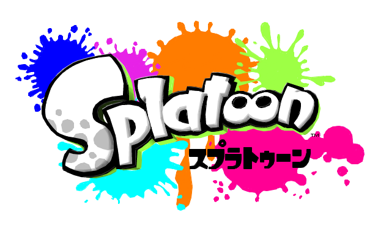

===================================

This is a Vim color scheme heavily inspired by [Splatoon](http://www.nintendo.co.jp/wiiu/agmj/).

Colors are selected randomly on `:colorscheme`! This color scheme is now only for gVim.

## Usage

Simply use `:colorscheme`

```vim
colorscheme splatoon
```

## Colorschemes

### `splatoon` color scheme

Regular Splatoon color scheme.  Uses preset Splatoon colors.


### `splatoon-1on1`

Only 2 colors are selected randomly from like battle in Splatoon.


### `splatoon-random`

Generate random Splatoon-like colors.


## License

Distributed under [the MIT license](http://opensource.org/licenses/MIT) except for [splatoon.png](splatoon.png).

    Copyright (c) 2015 rhysd

